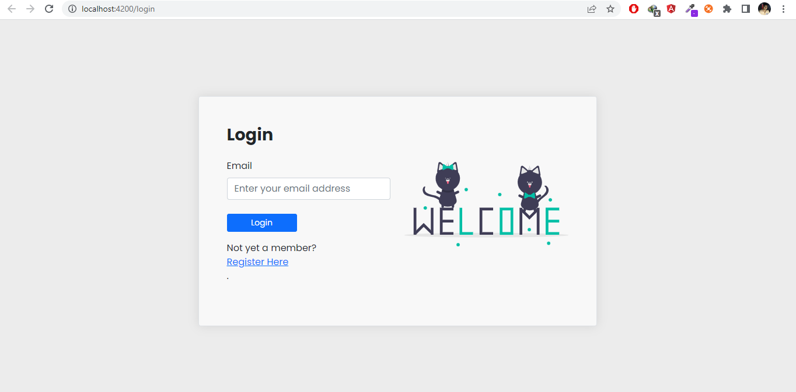

# Let's Chat Application
## Chat Page

## Registration Page

## Login Page

##Prerequisite
Noje.js (Recommendation: download the latest version of node.js)
Dotnet 6
Sql Server
Visual Studio 19+ 
vs code
Optional: Microsoft Sql Server Management Studio

# How to run
## Ready the backend App
1. First clone the repository using this command `git clone https://github.com/Rifat2022/Realtime-Chat-backend-Dotnet6.git`. This will clone the backend .NET6 app in your local directory.
2. Open it in the visual studio
3. Restore the Nuget packages
4. Download SQL Server and Sql Server management studio and connect using windows authentication. Create a Database name exactly as "LetsChatApplicationDb"
5. Go to package manager console terminal.
6. Run `Enable-Migrations`
7. Then run `Add-Migration InitialCreate`
8. Then run `Update-Database`
9. Run the Application using `F5` and this will start the applicaiton

## Run the Frontend App
1. Go to the root directory and run `npm install` and this will install the require packages in the node_modules
2. Then run the project using `npm start`

This project was generated with [Angular CLI](https://github.com/angular/angular-cli) version 14.2.7.

## Running end-to-end tests

Run `ng e2e` to execute the end-to-end tests via a platform of your choice. To use this command, you need to first add a package that implements end-to-end testing capabilities.

## Further help

To get more help on the Angular CLI use `ng help` or go check out the [Angular CLI Overview and Command Reference](https://angular.io/cli) page.
