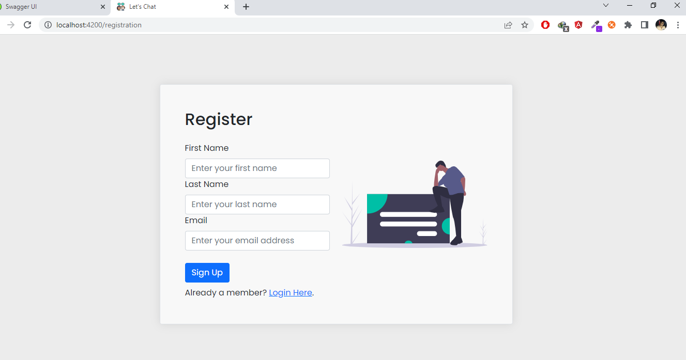
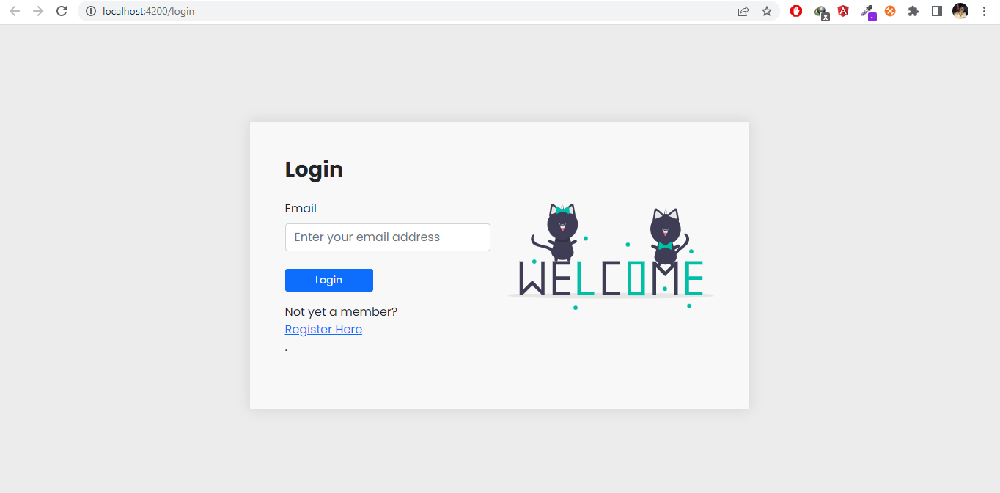
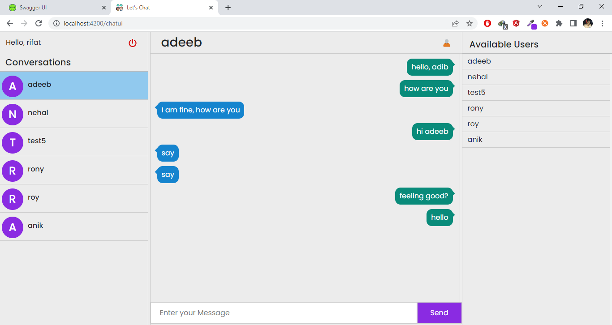

# Real-Time-Chat-App

Database Schema
----------------
<b>UsersInfo</b> <br>

↳ Id : int <br>
↳ Email : string <br>
↳ FirstName : string <br>
↳ LastName : string <br>

<b>MessageInfo</b> <br>

↳ Id : int <br>
↳ text: string <br>
↳ SenderId : int <br>
↳ ReceiverId : int <br>

Backend
----------
<b>Prerequisite:</b> 
1. ASP.Net Core 6.0 
  - You can download it within Visual Studio 2019 by accessing Visal Studio Installer which you can download and install from https://visualstudio.microsoft.com/downloads/
  - After installation run Visual Studio Installer, click install and from the options make sure ASP.NET and web development is selected. From there intall it by following the setup instructions.
2. Microsoft SQL Express 2018 
  - You can download and install the express version form the follwing link https://www.microsoft.com/en-us/sql-server/sql-server-downloads and follow the instruction given by the setup.
<b>Development Tools: </b>
1. Visual Studio 2019
  - Visual Studio 2019 can be installed by first installing Visal Studio Installer which you can download and install from https://visualstudio.microsoft.com/downloads/
2. Microsoft SQL Server Management Studio 18.
  - Download and install from https://docs.microsoft.com/en-us/sql/ssms/download-sql-server-management-studio-ssms?view=sql-server-ver15
  
<b>Process for running development environment:</b>
1.	Open the solution of the backend (.sln file) in Visual Studio 2019 IDE.
  - Wait for some time to let visual studio to download the required packages automatically. 
  - If not downloaded, head on to <code>Tools->NuGet Package Manager ->Manage NuGet package for solution</code> and download the required packages: <br>
o	Microsoft.EntityFrameworkCore<br>
o	Microsoft.EntityFrameworkCore.Tools <br>
o	Microsoft.EntityFrameworkCore.SQLServer <br>
o	Microsoft.AspNetCore.SignalR <br>

3. Head on to appsettings.json in solution explorer and put your respective server name in the connection string inside <code>Server =  ;</code> area below. You can generally find it Microsoft SQL Server Management Studio 18 during connecting to a server.
```
  "ConnectionStrings": {
    "DefaultConnection": @"Server="DESKTOP-GQTCJFO";Database=LetsChatApplicationDb;Trusted_Connection=True;MultipleActiveResultSets=True"
  },
```
 
4.	Then go to <code>Tools->NuGet Package Manager ->Package Manager Console</code> and after the console opens, run the command <code>update-database</code>. This will create the database in your MS SQL server.
5.	Run the code using <code>ctrl+F5</code> or clicking <code>IIS EXPRESS</code> run button.
6.	The server will start on the url https://localhost:7005 on the background in default browser.

Frontend
---------
<b>Prerequisite:</b> 
1. Node JS <br>
  - To install node js go to https://nodejs.org/en/. The recommended version will do. <br>
  - To check if node js is installed or not, open terminal and type <code>node –v</code> which will give the version installed in the system.<br>
2. Angular JS 14 <br>
  - Install angular js cli by using the command in command prompt <code>npm install -g @angular/cli</code> <br>

<b>Development Tools: </b>
1. Visual Studio Code <br> 
  - Install visual studio code from https://code.visualstudio.com/download <br>
2. Command Prompt <br>
  - Open command promt by pressing <code>win + r</code> and then typing in <code>cmd</code> and press <code>Enter</code> <br>
  
<b>Process for running development environment:</b>
1.	After installing the prerequisite go to the project folder and access command prompt from there. Shortcut <code> Ctrl+ ` </code> for opening command propmt.
2.	Use the command <code>npm install</code> to install all the packages required.
3.	To run the project type the command <code>ng serve –o </code>. <i>(-o for opening the project on default browser.)</i>
4.	The server will then be started and can be accessed by the url http://localhost:4200

Screenshots
------------
1. <b>Register Page</b>


2. <b>Login Page</b>


3. <b>Chat Page</b>

